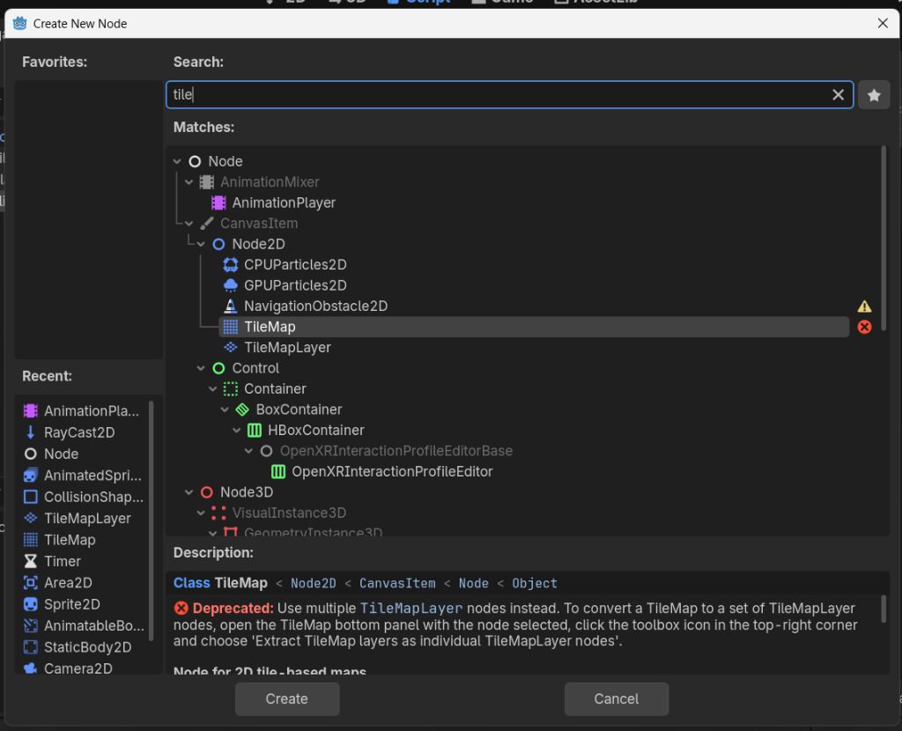

# Knight's Journey

> [!WARNING]
> **Learning Project Disclaimer**
> This is a learning project based on a tutorial by another creator. The project is created solely for educational and self-learning purposes.
> If you want to learn, you can watch the original YouTube tutorial:
> * **Title:** [How to make a Video Game - Godot Beginner Tutorial](https://www.youtube.com/watch?v=LOhfqjmasi0&t=4499s)
>
> This reference is not a promotion. If you are doing the same tutorial, you can use the resources in this repository or access the source creator's original project links in their video description.

> [!NOTE]
> **Project Specifications**
> - **Game Engine:** Godot Engine
> - **Version:** `Godot_v4.6.3-stable_win64`

---

## Table of Contents
1. [Introduction: About this Project](#1-introduction-about-this-project)
2. [Things That I Did](#2-things-that-i-did)
3. [Problems Faced & Solutions](#3-problems-faced--solutions)
4. [Differences from the Source Tutorial](#4-differences-from-the-source-tutorial)
5. [How to Play & Controls](#5-how-to-play--controls)

---

## 1. Introduction: About this Project
**Knight's Journey** is a classic 2D pixel-art game. In this game, the player controls a brave knight who explores a vibrant world while collecting coins. 
- **Characters:** The game features a single playable character—the Knight.
- **Key Features:**
  - Background music playing in a continuous loop.
  - Interactive coin collection system.
  - Patrolling green and purple slimes that guard specific areas.

---

## 2. Things That I Did
By following the tutorial step-by-step, I successfully implemented almost all the activities and mechanics shown in the video. The creator's detailed explanations and attention to small details made it very smooth to follow along and recreate the game structure, nodes, and scripts.

---

## 3. Problems Faced & Solutions

### 1. Tilemap Node Deprecation (Video Timestamp: 22:50)
* **Problem:** In the tutorial, the creator uses the `TileMap` node to design the levels. However, in newer versions of Godot (like `v4.6`), the `TileMap` node is deprecated and marked with a red warning cross in the Create Node menu.
* **Workaround:** For this project, you can continue using the deprecated `TileMap` node just like the creator. It will still work and won't affect the gameplay.
* **Future Solution:** For future projects or upgrades, you should use the new `TileMapLayer` nodes instead. Godot provides a built-in extraction tool to convert a `TileMap` into individual `TileMapLayer` nodes.

> [!IMPORTANT]
> **Web Deployment Challenge (SharedArrayBuffer):**
> When exporting a Godot 4.x game to run in a web browser via GitHub Pages, the game fails to load by default because GitHub Pages doesn't serve the required security headers for multithreading.
> * **Solution:** We will integrate `coi-serviceworker.js` to intercept browser requests and supply the correct headers.

---

## 4. Differences from the Source Tutorial
Currently, this project matches the tutorial video's assets, logic, and level design. No custom features or structural differences have been added compared to the source tutorial.

---

## 5. How to Play & Controls
You can move and jump using the following key bindings:

| Action | Primary Keys | Alternative Keys |
| :--- | :--- | :--- |
| **Move Left** | `A` | Left Arrow |
| **Move Right** | `D` | Right Arrow |
| **Jump** | `W` / `Space` | Up Arrow |
